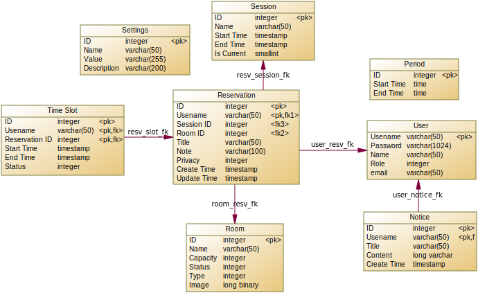

# Database Schema

The database schema consists of the following components:

schema.sql: This file contains the SQL statements for creating the necessary tables in the database.

schema.py: This script handles the insertion of constants, such as reservation status, into the relevant tables. Additionally, it creates triggers to enforce data integrity and maintain consistency within the database.

## Entity Relationship Diagram

## Tables

- `users`

The `users` table stores user information in the system, including their username, name, password, role, and email.

- `rooms`

The `rooms` table contains information about the rooms in the system, such as their type, status, name, capacity, and image.

- `sessions`

The `sessions` table represents sessions in which users can make reservations, like school semesters. The `is_current` column indicates if the session is the current session.

- `reservations`

The `reservations` table stores information about room reservations. It includes the basic details of a reservation. Multiple time slots can be reserved at once, and the details of each time slot are stored in the `time_slots` table.

The `privacy` column controls the visibility of reservation details based on user privileges.

- `time_slots`

The `time_slots` table stores the time slots of reservations. Each time slot has a `status`, indicating whether it is pending, approved, rejected, etc. Storing the `status` in the `time_slots` table allows individual time slots to be managed separately from the entire reservation.

- `settings`

The `settings` table contains system configuration settings, such as the maximum reservation time and time window.

- `periods`

The `periods` table holds predefined time periods. Administrators define periods like 8:00-9:00, which users can select and combine to create reservation time slots.

- `notices`

The `notices` table stores the notices that are displayed to users.

## Extended Tables

To provide additional information and support potential future translations, several integer attributes in the database are represented by foreign keys. These attributes have their own tables, which include columns for labels and descriptions. 

- `user_roles`: `role` attribute used in `users` table
- `room_types`: `type` attribute used in `rooms` table
- `room_status`: `status` attribute used in `rooms` table
- `resv_privacy`: `privacy` attribute used in `reservations` table
- `resv_status`: `status` attribute used in `time_slots` table

## Database constants

The system incorporates various constants that are inserted into the database during initialization. These constants are immutable and play a crucial role in system management.

- Reservation privacy

The `resv_privacy` table defines the possible values for the `privacy` attribute. This attribute controls the visibility of reservation details based on user privileges. The available values are:

Value | Label | Description
--- | --- | ---
0 | Public | Reservation details visible to all users.
1 | Anonymous | Reservation details visible to all users, but the user who made the reservation remains anonymous.
2 | Private | Reservation details visible only to the user who made the reservation.

- Reservation status

The `resv_status` table enumerates the possible values for the `status` attribute in the `time_slots` table. The `status` attribute indicates the current status of a time slot. The valid values are:

Value | Label | Description
--- | --- | ---
0 | Pending | awaiting approval.
1 | Confirmed | has been approved.
2 | Cancelled | has been cancelled.
3 | Rejected | has been rejected.

- Room status

The `room_status` table contains the possible values for the `status` attribute in the `rooms` table. The `status` attribute signifies the current status of a room. The permissible values are:

Value | Label | Description
--- | --- | ---
0 | Unavailable | The room is not available for reservations.
1 | Available | The room is available for reservations.

- User roles

The `user_roles` table defines the potential values for the `role`
attribute in the `users` table. The `role` attribute denotes the role of
a user. The available values are:

Value | Label | Description
--- | --- | ---
-2 | Inactive | User unable to log in.
-1 | Restricted | User unable to make reservations.
0 | Guest | Basic reservation pending approval.
1 | Basic | Basic reservation auto-approved. Advanced reservation pending approval.
2 | Advanced | Advanced reservation auto-approved. Admin reservation auto-approved.
3 | Admin | User with admin privileges.

- Settings

The `settings` table contains various configurable settings for the
system. The possible values are as follows:

Value | Label | Format | Description
--- | --- | --- | ---
1 | Time window | `HH:mm:ss` | Defines the time window for making reservations from the current time.
2 | Time limit | `HH:mm:ss` | Specifies the maximum duration of a reservation.
3 | Max daily | Number (int) | Sets the maximum number of reservations a user can make in a day.
